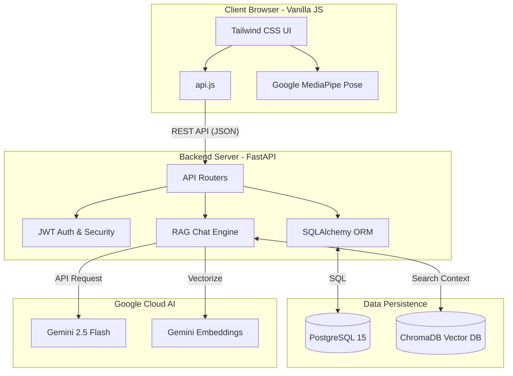
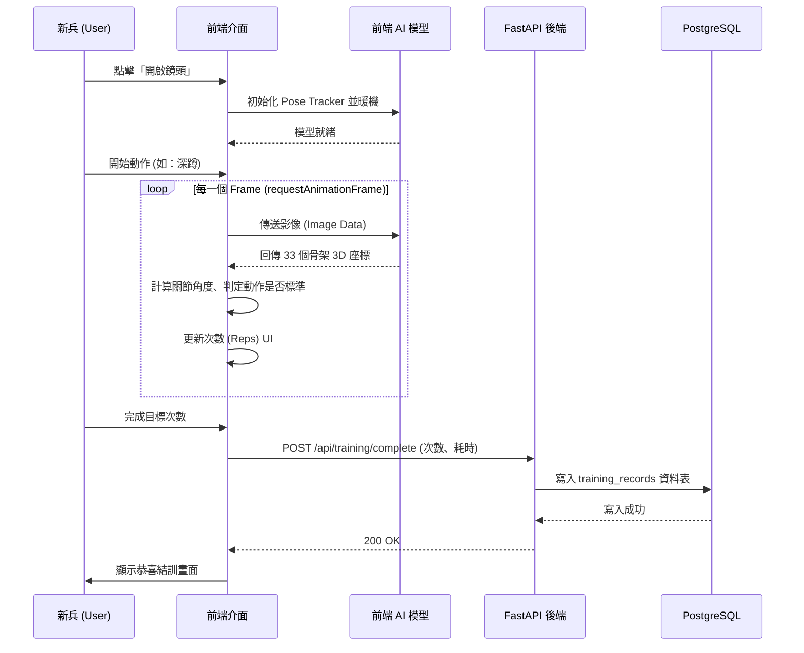
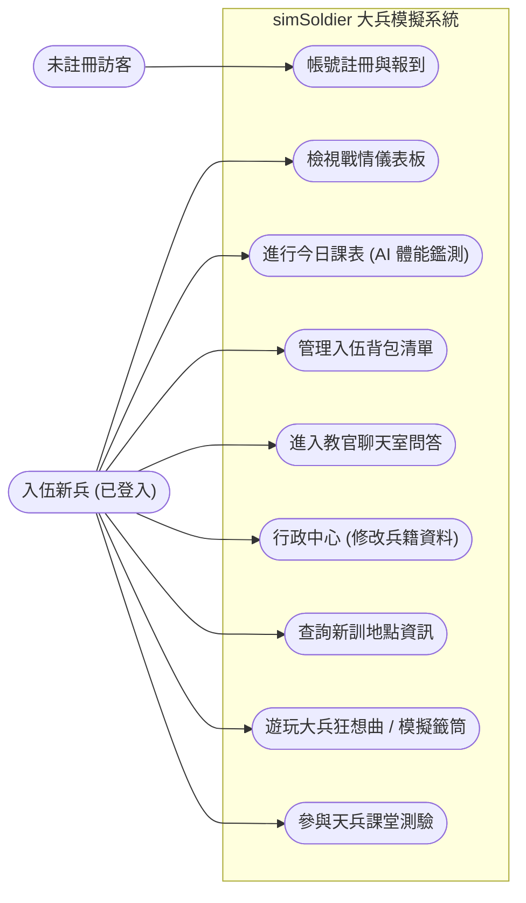

# 系統概要設計與架構書 (System Architecture)
**專案名稱**：大兵模擬系統 (simSoldier)  
**文件性質**：畢業專題系統架構文件  
**版本**：1.0  

---

## 第一節：系統架構與技術選型

本專案採用 **Client-Server (前端-後端分離)** 架構，並結合了雲端大型語言模型 (LLM) 與邊緣運算視覺模型 (Edge Vision AI) 進行混合運算。

### 1.1 核心技術棧清單

| 分層 | 核心技術 / 套件 | 選擇理由 |
| :--- | :--- | :--- |
| **前端 (Client)** | **Vanilla JavaScript** (ES6 Modules) | 為了極致化邊緣端的 AI 執行效能（如影像辨識），摒棄了 React/Vue 等框架，採用原生 JS 來直接操作 DOM 與 Canvas，降低框架額外負載。 |
| **前端樣式** | **Tailwind CSS** | 提供原子化 CSS (Utility-first) 解決方案，能快速迭代軍事風格的 UI 介面，並透過 CDN 輕量化引入。 |
| **前端 AI 模組** | **Google MediaPipe Pose** | 用於「今日課表」與「大兵狂想曲」的即時肢體追蹤。可直接在瀏覽器 (Edge) 端使用 WebAssembly 與 WebGL 進行硬體加速，不會消耗伺服器頻寬與運算資源。 |
| **後端 (Server)** | **Python 3.11 + FastAPI** | FastAPI 具備極高的非同步 (Asynchronous) 處理效能與自動化 OpenAPI 文件生成能力，非常適合建立 AI 對話與資料 CRUD 的 API 端點。 |
| **後端 AI 引擎** | **Google Gemini 2.5 Flash** | 作為「教官聊天室」的大腦，速度極快且擁有強大的語意理解與角色扮演能力，能完美模擬軍中教官的威嚴語氣。 |
| **向量資料庫 (RAG)** | **ChromaDB** | 輕量級的開源向量資料庫，直接內嵌於後端運行，用於將軍中常識、法規轉換為向量 (Embeddings)，使 LLM 能基於本地知識庫進行精準回答 (RAG架構)。 |
| **關聯式資料庫** | **PostgreSQL 15** | 企業級的開源關聯式資料庫，支援強大的事務處理 (ACID)，用於儲存使用者個資與長期的體能訓練紀錄。 |
| **ORM 套件** | **SQLAlchemy** | 作為 Python 與 PostgreSQL 的橋樑，防止 SQL Injection 並加速資料表操作。 |
| **認證機制** | **JWT (JSON Web Token)** | 採用無狀態 (Stateless) 認證機制，配合 `bcrypt` 雜湊加密密碼，保障新兵個資安全。 |

---

## 第二節：核心處理流程

本系統包含三大核心模組：**使用者驗證與儀表板**、**AI 體能訓練系統**、**RAG 智慧教官聊天室**。

### 2.1 AI 體能訓練流程 (Edge AI)
1. 使用者在前端點擊「開始訓練」，呼叫後端 API 產生一組 `session_token` 標記本次訓練。
2. 前端透過 WebRTC API 啟動網路攝影機 (`getUserMedia`)。
3. `training_ai.js` 攔截影像串流，送入 **MediaPipe Pose** 模型，擷取全身 33 個骨架節點 (Landmarks) 的座標。
4. 前端邏輯分析節點角度（例如：計算深蹲時大腿與小腿的夾角、或仰臥起坐的肩膀高度），實作「狀態機 (State Machine)」進行動作次數計算。
5. 訓練完成後，前端彙整「總次數、耗時」加上 `session_token`，發送 POST 請求至 `/api/training/complete`，後端將成績寫入資料庫。

### 2.2 智慧教官聊天室流程 (RAG Architecture)
1. 使用者在前端聊天室輸入文字問題。
2. 後端 `chat.py` 收到問題後，呼叫 `gemini-embedding-001` 模型將文字轉化為向量矩陣。
3. 在 **ChromaDB** 中進行相似度比對 (Similarity Search)，檢索出相關的「軍中知識庫」條目。
4. 將檢索出的知識文本 (Context)、使用者的基本資料 (User Info)，連同強制的「經典罵人台詞」組合入 Prompt。
5. 發送至 **Gemini 2.5 Flash** 模型，生成符合教官人設的回應，並將純文字返回前端顯示。

---

## 第三節：資料表設計邏輯 (Database Schema)

資料庫採用 PostgreSQL，以下為核心資料表之 Schema 與設計思維：

### 1. `users` (新兵個資表)
紀錄使用者的核心驗證資訊與生理數據。
*   `id` (Integer, **PK**): 唯一流水號。
*   `username` (String, **Unique**): 登入帳號/姓名。
*   `role` (Integer, **FK** to `roles.id`): 權限角色（例如：新兵、長官）。
*   `game_currency` (Integer): 系統代幣（如榮譽假點數、福利社點數，未來擴充）。
*   `date_of_birth` (Date): 生日。
*   `date_of_registration` (DateTime): 報到（註冊）時間。
*   `height` / `weight` (Integer): 身體數值，可用於計算 BMI。
*   `entrance_date` (Date): 入營日期，用於前端倒數計時。
*   `do_have_chronic_medications` (Boolean): 痼疾/慢性病紀錄。
*   `hashed_password` (String): 加密後的密碼。

### 2. `training_records` (訓練紀錄表)
紀錄使用者每一次 AI 體能訓練的成績，用於分析成長趨勢。
*   `id` (Integer, **PK**): 唯一流水號。
*   `user_id` (Integer, **FK** to `users.id`): 關聯之新兵。
*   `date` (DateTime): 鑑測時間。
*   `exercise_type` (String, **Index**): 測驗項目（如 squat, pushup, situp）。
*   `reps` (Integer): 完成次數。
*   `duration_seconds` (Integer): 測驗耗時（秒）。
*   `is_valid` (Boolean): 紀錄是否有效（防作弊機制擴充）。

### 3. `quiz_questions` (軍事常識題庫)
*   `id` (Integer, **PK**): 題號。
*   `question` (String): 題目敘述。
*   `option_a` ~ `option_d` (String): 選擇題四個選項。
*   `correct_option` (String): 正確解答 (A/B/C/D)。
*   `explanation` / `source` (String): 解析與法規來源。

---

## 第四節：系統視覺化圖表

### 4.1 系統整體架構圖 (System Architecture Diagram)

### 4.2 核心流程圖：AI 體能訓練流程 (Flowchart)

### 4.3 使用案例圖 (Use Case Diagram)

---

## 第五節：系統開發工具與運行環境要求

### 5.1 開發工具
*   **版本控制**：Git
*   **整合開發環境 (IDE)**：Visual Studio Code (搭配 GitHub Copilot / Cursor)
*   **容器化技術**：Docker & Docker Compose
*   **資料庫圖形化工具**：DBeaver 或 pgAdmin (開發階段用)
*   **API 測試工具**：Swagger UI (FastAPI 內建 `http://localhost:8000/docs`)

### 5.2 系統運行環境需求 (部署)
| 元件 | 最低需求 | 說明 |
| :--- | :--- | :--- |
| **作業系統** | Linux (Ubuntu 20.04+) / Windows 10+ | 支援 Docker 運行的系統皆可 |
| **後端環境** | Python 3.11 | 依賴 `uvicorn` 及非同步套件 |
| **前端環境** | Node.js / HTTP Server | 前端靜態檔案透過 `python -m http.server` 或 Nginx 部署 |
| **資料庫** | PostgreSQL 15 | 系統使用 docker-compose 自動拉取 |
| **用戶端硬體** | 具備 720p 以上視訊鏡頭之 PC/Mac | **必須具備 WebGL 支援的瀏覽器 (Chrome 90+)** 以利 MediaPipe 運作 |

---

## 第六節：專案 SWOT 分析

基於本專案之架構與實作成果，以下為系統之 SWOT 分析矩陣：

| | 有利因素 (Helpful) | 不利因素 (Harmful) |
| :--- | :--- | :--- |
| **內部因素 (Internal)** | **優勢 (Strengths)**   1. **邊緣運算優勢**：影像 AI 運算完全在前端執行，伺服器零負載，無影片外洩隱私疑慮。  2. **RAG 架構靈活**：教官知識庫透過 ChromaDB 管理，可隨時抽換軍事手冊，且回答帶有濃厚的軍事沈浸感。  3. **輕量化架構**：摒棄肥重的 JS 框架，Vanilla JS 配合 Tailwind 使載入速度極快。 | **劣勢 (Weaknesses)**   1. **依賴客戶端硬體**：若使用者手機或電腦 GPU 效能過差，MediaPipe 幀數可能偏低，影響判斷準確度。  2. **安全驗證瓶頸**：目前前端 AI 動作判定若被破解（發送偽造的 completion API），後端難以驗證影像真實性。 |
| **外部因素 (External)** | **機會 (Opportunities)**   1. **役期延長政策**：台灣兵役恢復為一年，新兵入伍前的「預先體驗與焦慮緩解」需求大幅上升。  2. **AI 話題熱潮**：結合生成式 AI 與計算機視覺 (CV)，具備高度的話題性與展示 (Demo) 吸引力。 | **威脅 (Threats)**   1. **第三方 API 限制**：高度依賴 Google Gemini API，若發生 API 額度限制 (Rate limit) 或服務中斷，聊天室將停擺。  2. **環境光源干擾**：計算機視覺在過暗或背光的房間內，骨架抓取容易飄移，導致使用者體驗不佳。 |

---
*Generated by simSoldier Architecture Team*
